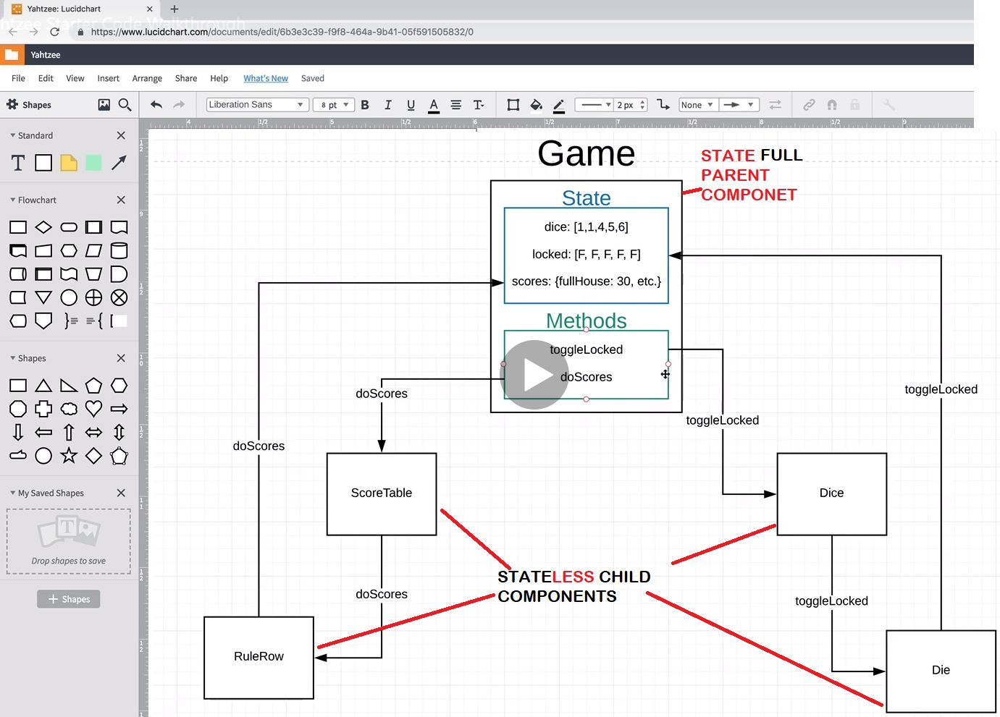

<!-- START doctoc generated TOC please keep comment here to allow auto update -->
<!-- DON'T EDIT THIS SECTION, INSTEAD RE-RUN doctoc TO UPDATE -->
**Table of Contents**  *generated with [DocToc](https://github.com/thlorenz/doctoc)*

- [About app generation](#about-app-generation)
  - [Available Scripts](#available-scripts)
    - [`npm start`](#npm-start)
    - [`npm test`](#npm-test)
    - [`npm run build`](#npm-run-build)
    - [`npm run eject`](#npm-run-eject)
  - [Learn More](#learn-more)
    - [Code Splitting](#code-splitting)
    - [Analyzing the Bundle Size](#analyzing-the-bundle-size)
    - [Making a Progressive Web App](#making-a-progressive-web-app)
    - [Advanced Configuration](#advanced-configuration)
    - [Deployment](#deployment)
    - [`npm run build` fails to minify](#npm-run-build-fails-to-minify)
- [React app some basics](#react-app-some-basics)
  - [Usefull libraries:](#usefull-libraries)
  - [Props have children](#props-have-children)
  - [State vs props](#state-vs-props)
  - [Search field filter with functional component](#search-field-filter-with-functional-component)
  - [JSS withStyles:](#jss-withstyles)
  - [Store website in github for free - deploy](#store-website-in-github-for-free---deploy)
- [React Hooks - are great!](#react-hooks---are-great)
- [Context in React is about passing properties between a component and distant components (in the component tree)](#context-in-react-is-about-passing-properties-between-a-component-and-distant-components-in-the-component-tree)
- [Transform the previous class based components into function=hooks based components - clean implementation](#transform-the-previous-class-based-components-into-functionhooks-based-components---clean-implementation)
- [State Management w/ useReducer and useContext](#state-management-w-usereducer-and-usecontext)
  - [Add in Todo Context](#add-in-todo-context)
  - [Consuming the Todo Context](#consuming-the-todo-context)
- [Introduce a new pattern - instead of multiple methods write a single function - a reducer - fix reloading issue](#introduce-a-new-pattern---instead-of-multiple-methods-write-a-single-function---a-reducer---fix-reloading-issue)
- [Memo - Higher Order Component built into React - To Speed Up the App](#memo---higher-order-component-built-into-react---to-speed-up-the-app)
- [Use Custom Hook: Reducer + LocalStorage](#use-custom-hook-reducer--localstorage)

<!-- END doctoc generated TOC please keep comment here to allow auto update -->

# About app generation

This project was bootstrapped with [Create React App](https://github.com/facebook/create-react-app).

## Available Scripts

In the project directory, you can run:

### `npm start`

Runs the app in the development mode.<br>
Open [http://localhost:3000](http://localhost:3000) to view it in the browser.

The page will reload if you make edits.<br>
You will also see any lint errors in the console.

### `npm test`

Launches the test runner in the interactive watch mode.<br>
See the section about [running tests](https://facebook.github.io/create-react-app/docs/running-tests) for more information.

### `npm run build`

Builds the app for production to the `build` folder.<br>
It correctly bundles React in production mode and optimizes the build for the best performance.

The build is minified and the filenames include the hashes.<br>
Your app is ready to be deployed!

See the section about [deployment](https://facebook.github.io/create-react-app/docs/deployment) for more information.

### `npm run eject`

**Note: this is a one-way operation. Once you `eject`, you can’t go back!**

If you aren’t satisfied with the build tool and configuration choices, you can `eject` at any time. This command will remove the single build dependency from your project.

Instead, it will copy all the configuration files and the transitive dependencies (Webpack, Babel, ESLint, etc) right into your project so you have full control over them. All of the commands except `eject` will still work, but they will point to the copied scripts so you can tweak them. At this point you’re on your own.

You don’t have to ever use `eject`. The curated feature set is suitable for small and middle deployments, and you shouldn’t feel obligated to use this feature. However we understand that this tool wouldn’t be useful if you couldn’t customize it when you are ready for it.

## Learn More

You can learn more in the [Create React App documentation](https://facebook.github.io/create-react-app/docs/getting-started).

To learn React, check out the [React documentation](https://reactjs.org/).

### Code Splitting

This section has moved here: https://facebook.github.io/create-react-app/docs/code-splitting

### Analyzing the Bundle Size

This section has moved here: https://facebook.github.io/create-react-app/docs/analyzing-the-bundle-size

### Making a Progressive Web App

This section has moved here: https://facebook.github.io/create-react-app/docs/making-a-progressive-web-app

### Advanced Configuration

This section has moved here: https://facebook.github.io/create-react-app/docs/advanced-configuration

### Deployment

This section has moved here: https://facebook.github.io/create-react-app/docs/deployment

### `npm run build` fails to minify

This section has moved here: https://facebook.github.io/create-react-app/docs/troubleshooting#npm-run-build-fails-to-minify


#----------------------------------------- The modern React Bootcamp notes -----------------------------------------

```CSS
.alignedItem {
    display: flex;
    align-items: center;
    justify-content: space-between;
}
``` 
# React app some basics

## Usefull libraries:

```bash
npm i --save reactstrap react react-dom
npm i --save chroma-js
npm i --save bootstrap jquery popper.js
npm i --save react-router-dom
npm i --save copy-to-clipboard
npm i --save chroma-js
npm i --save @material/core @material-ui/core @material-ui/icons
npm i --save chroma-js
npm i --save uuid # generate unique ids
npm i axios # for ajax calls
npm i --save react-router-dom # use it with <BrowserRouter> component and <Switch><Route path=''></Switch>
```
## Props have children

Each component has the `props` object. If there are any elements given in between the starting and closing tag of a component, the the `props.children` object contains those elements

## State vs props

The state is an object that we pass down ( in the components tree) to child components - child components recevive the state as `props`
 NOTES:
1) minimize state and use has() method of Set type state...has(lt) could be checked with state.includes(lt)
2) parent component should be stateFULL, child components should be stateLESS, because each time the state changes, component reloads, all functions of that component are recreated
3) we architect  the component tree so that we put the state of the apropriate level ( only if there are child components interested in that state we move the state up so that all components requiring the state have access to it)



* Use Google Fonts ( [fonts.google.com](fonts.google.com))

## Search field filter with functional component

A simple component that just takes some props and returns some HTML;
Use it if you think you do not need internal state, nor access life cicle methods because it is easier to test, smaller and easier to read.
Beacause we put the search field functionality inside a dedicated component we can easily reuse the component.

```JSX
const searchBox = ({ placeholder, handleChange }) => (

  <input type="search"
   placeholder = { placeholder }
   // use `onChange` syntetic event from JSX not `onchange` event from HTML
   onChange = { handleChange } /> // we DO NOT call methods or functions on events - React will call the functions/methods when render() happens -  just specify wich function should be called when the event happens
)
// ..
this.state = {
  monsters: [],
  searchField: ''
}

render() {
  const { monsters, searchField } = state;
  const filteredMonsters = monsters.filter(monster => monster.name.toLowercase().includes(searchField.toLowerCase()));
  return (
    <SearchBox 
      placeholder = 'search monsters'
      handleChange = { e =>
          this.setState=({ searchField: e.target.value }), // setState is a async function and we give a second param a callback fc
          () => {
            // .. this callback function runs immediatly after the setState finishes
          }
     }/>
    <RenderListComponent monstersProp={filteredMonster} />
  )
}
```

Thus, we have the state at some parent component level, where all the others component also have access to the state and we use the event handle system  of React - whenever a change happens, a handle event will update the state.

##  JSS withStyles:

```JavaScript

myArray.find(x=> x.id===id);
// JSS withStyles:
const styles = {
    backgroundColor: "pink";
    "& h4": {
        color: "white";
    }
}

// and use css classes grab it from of props:
const {classess} = this.props;
<div className={classes.backgroundColor}>
</div>
// pass properties to minipalet componet using destructuring
<Minipalet {...pallete} /> 

<Link to="./" onClick="(e) => e.stopPropagation()" > // after click go to page and stop executing any other functionality for onClick
```

## Store website in github for free - deploy

```bash
# connect the project to the repo :
git remote add origin git@github.com:bitaemi/React-app-Hooks-Context-reducers.git # or use https instead of ssh
# include the github-pages package:
yarn add gh-pages
```
after this in package.json add:

```JSON
  "homepage": "https://bitaemi/github.io/React-app-Hooks-Context-reducers", //

// in "scripts" add:
// ..
    "predeploy": "yarn build", // build before deploy
    "deploy": "gh-pages -d build" // is going to serve that build to our github project
```
After that, run: 

```bash
yarn deploy # this will first predeploy and after that publish and create the gh-pages branch in your repo``
git add . # add your files and commit those on github
git commit -m "added github pages"
git push origin master # you do not have gh-pages branch on your local reppo archive
```
Go in the github interface and in repo's Settings -> Check that Source for gh-pages points to gh-pages branch
# React Hooks - are great!

```JavaScript
import React, { useState, useEffect } from "react";
import axios from "axios";

function SWMovies() {
  // number is the property from state that changes with the callback of setNumber ??
  const [number, setNumber] = useState(1); // initial state is 1
  const [movie, setMovie] = useState("");
  
  // useEffect is = to ngOnChanges from Angular - executes wach time detects a change and first time before ngOnInit
 
  useEffect(() => {
    async function getData() {
      const response = await axios.get(`https://swapi.co/api/films/${number}/`);
      setMovie(response.data);
    }
    getData();
  // thus pay attention when fetching data inside useEffect !!! Always pass the second parameter - the condition to
  // execute the async function only when one of the elements from second parameter change (here : 'number')
  }, [number]);

  return (
    <div>
      <h1>Pick A Movie</h1>
      <h4>{movie.title}</h4>
      <p>{movie.opening_crawl}</p>
      <select value={ number } onChange={ e => setNumber(e.target.value) }>
        <option value='1'>1</option>
        <option value='2'>2</option>
        <option value='3'>3</option>
      </select>
    </div>
  );
}
export default SWMovies;
```

# Context in React is about passing properties between a component and distant components (in the component tree)

```JavaScript
// the component where we consume the data (PageContent component)
import { ThemeContext } from "./contexts/ThemeContext";

export default class PageContent extends Component {
  // we set contextType to theme context and thus we are able to read the state directly from context
  // if you whant to consume more then one context, this is not going to work
  
  static contextType = ThemeContext; // this tells the component to look for the ThemeContext somewhere above it
  render() {
    const { isDarkMode, toggleTheme } = this.context;
    // ...
  }

  // In order to update the state we need to pass in the ThmeContext's Provider as value, the new state including the updated property corresponding to the event

  // ..
        <ThemeContext.Provider
        value={{ ...this.state, toggleTheme: this.toggleTheme }}
      ></ThemeContext.Provider>
  // ..

  // ...
  // for those components that consume more than one contexts, we use consumer components
  // create a high order component, wich takes a different component and some props,as argument,
  // and returns that same component, with all it's original props, but also it injects in a property
  // e.g laguageContext, coming from the consumer taht takes the value from consumer
  export const withLanguageContext = Component => props => (
    // Component is just a generatic name for whatever component we pass
    // for those components that consume more than one contexts, we use consumer components
    // these components take as child function components:
    <LanguageContext.Consumer>
      {value => <Component languageContext={value} {...props} />}
    </LanguageContext.Consumer>
  );

  // in the component where we consume the data (Navbar) we use:
  export default withLanguageContext(withStyles(styles)(Navbar));
  // this takes the Navbar that was wrapped with the styles - this new version of the navbar si once again wrapped, this time with withLanguageContext
  // so, it returns a new version of the Navbar, now containing languageContext, as a prop
  ```

# Transform the previous class based components into function=hooks based components - clean implementation

```JavaScript
import React, { createContext, useState } from "react";

export const LanguageContext = createContext();

// we DO NOT HAVE 'this' in a function based component
// we pass props as argument
// we use 'useState' to get the state
export function LanguageProvider(props) {
  const [language, setLanguage] = useState("spanish");
  const changeLanguage = e => setLanguage(e.target.value);
  return (
    <LanguageContext.Provider value={{ language, changeLanguage }}>
      {props.children}
    </LanguageContext.Provider>
  );
}
```

Now there is no need to use that Higher Order Component, we do not need any more to add a second wrapper to the Navbar component, that became a hook based component.


# State Management w/ useReducer and useContext

## Add in Todo Context

```JavaScript
import React, {createContext} from "react";
import useTodoState from "../hooks/useTodoState";

const defaultTodos = [
    {id: 1, task: "Make new notes for Security study", completed: false},
    {id: 2, task: "Release lady bugs into garden", completed: true} 
];

//  create the context itself

export const TodosContext = createContext();
// we already have the useTodoState hook that gives us all the pieces we need
// what is missing is a context that will call this hook and then use these pieces and store them as a value for that context
console.log(TodosContext)
export function TodosProvider(props) {
    // const { todos, addTodo, removeTodo, toggleTodo, editTodo } = useTodoState(defaultTodos);
    // because  we use all the pieces from the hook we can shorten out the object (to todosStuff) that we pass as value in the returned component 
    const { todosStuff } = useTodoState(defaultTodos);

    return (
        <TodosContext.Provider value={{ todosStuff } }>
            {/* the component TodosProvider will wrapp around to whatever the children are */}
            {props.children}
        </TodosContext.Provider>
    )
}
```

Now, in the TodoApp.js we are able to use the TotosProvider wrapper (our functional component):

```JavaScript
   <TodosProvider>
      <TodoForm addTodo={addTodo} />
      <TodoList
        todos={todos}
        removeTodo={removeTodo}
        toggleTodo={toggleTodo}
        editTodo={editTodo}
      />
      {/* <button onClick={()=>setMood("angry")}>Click to get angry</button> */}
  </TodosProvider>
```
## Consuming the Todo Context

We need to include useContext hook in all the components that need access to that context.

```JavaScript
function TodoForm() { // do pass anymore { addTodo} as parameter
  const { addTodo } = useContext(TodosContext); // get the { addTodo}  from the TodosContext
  // ..
```

The TodoList function becomes:

```JavaScript
function TodoList() { // no need for params
  const { todos } = useContext(TodosContext); // we need only the todos list from the TodosContext
  if (todos.length)
    return (
      <Paper>
        <List>
          {todos.map((todo, i) => (
            // To add a key to a fragment, we have to use the long-hand version
            // rather than <> </>, we have to use <React.Fragment>
            <React.Fragment key={i}>
              <Todo
                {...todo}
                key={todo.id} // we removed the addTodo, removeTodo, ... no need because we were just passing those down
              />
              {i < todos.length - 1 && <Divider />}
            </React.Fragment>
          ))}
        </List>
      </Paper>
    );
  return null;
}
```
... do the same for the other components ...

# Introduce a new pattern - instead of multiple methods write a single function - a reducer - fix reloading issue

For each piece of functionality, inside the useTodoState hook, we create a new method and also we have to use the TodosContext and get each this kind of function, in each file we whant to use it.
A cleaner way is to write a single function, called a reducer. This fc. takes an input, and dependig on the action specified as an input, and it will return the appropriate state.

Now there's a third one.

And the way that a context works whenever its value changes it has one single value.

Whenever something in that value changes it's going to pass down new data causing a re render in whatever

components are consuming that context.

So all of our components right now are consuming our TodosContext.

The fact is that the context is changing and it's passing down new information to the components, even thought we're just not using

the exact info that changed, if is part of the context and we're getting all the data because in the todos.contex.js, in the TodosCntext Provider we pass all the data:

```JavaScript
  <TodosContext.Provider value={{ todos, addTodo, removeTodo, toggleTodo, editTodo } }>
      {/* the component TodosProvider will wrapp around to whatever the children are */}
      {props.children}
  </TodosContext.Provider>
```        
The undesired effect and deffect is that each time an element from todos changes, all the components that use the TodosContext are re-rendering (though they only get from the TodosContext, only the methods, wich do not change).
=> we need to split up the context in 2 contexts: 
 - store the methonds wich do not change in a separate context
 - a context for the state that needs to trigger frequenly

 ## useReducer - a built-in Hook - an alternative to useState

 The useReducer accepts a reducer of (type, action) => newState, and returns the current state paired with a dispach method;

 ```JavaScript 
 const [state, dispatch] = useReducer(countReducer, {count: 10});
 // useReducer makes a piece of state, that was set initialy to {count:10} and it returns that piece of state (state), so we have access to it, and also returns the dispatch,
 // which is using the contReducer that, whenever we call dispatch, we pass it an action, while whatever is returned from countReducer at each dispatch, will update the state
 ```

The TodosProvider  becomes:

```JavaScript
export function TodosProvider(props) {
    const [todos, dispatch] = useReducer(todoReducer, defaultTodos);
    return (
        <TodosContext.Provider value={{ todos, dispatch } }>
            {/* the component TodosProvider will wrapp around to whatever the children are */}
            {props.children}
        </TodosContext.Provider>
    )
}
```
Next, update all components that use data from the TodosContext, eg: TodoForm:

```JavaScript
function TodoForm() {
 // ...
  const { dispatch } = useContext(TodosContext); // get the { dispatch}  from the TodosContext

  return (
    <Paper style={{ margin: "1rem 0", padding: "0 1rem" }}>
      <form
        onSubmit={e => {
          e.preventDefault();
          dispatch({type: "ADD", task: value}) // we no longer have addTodo method, but the generic dispatch method
          // ...
```

Fix the issue splitting into 2 contexts:

```JavaScript
export const TodosContext = createContext();
export const DispatchContext = createContext();

// we already have the useTodoState hook that gives us all the pieces we need
// what is missing is a context that will call this hook and then use these pieces and store them as a value for that context
export function TodosProvider(props) {
    const [todos, dispatch] = useReducer(todoReducer, defaultTodos);
    return (
        // in the TodosContext we need to pass just one thing, not an object like before
        <TodosContext.Provider value={todos}>
            {/* pass  the actual value of dispatch - not a new object */}
            <DispatchContext.Provider value={dispatch}>
                {/* the component TodosProvider will wrapp around to whatever the children are */}
                {/* props.children are wrapped in 2 compenents */}
                {props.children}
            </DispatchContext.Provider>
        </TodosContext.Provider>
    )
}
```
#  Memo - Higher Order Component built into React - To Speed Up the App

Because the todos is changing and we are mapping over todos, when a todo is changing, all todos components re-render = deffect;
If we had a class based componend we would use PureComponent, instead of Component:

```JavaScript
class Todos extends PureComponent {

}
```
With functional components we use React.memo component, that we wrapp around my entire functional component.

In Todo.js:

```JavaScript
export default memo(Todo);
```
- with this, React is simply remembering the old component and if there is no change, it will just render the component from cache.
# Use Custom Hook: Reducer + LocalStorage

Instead of using useState in order to operate on LocalStorage, we are going to use useReducer

```JavaScript
// ...
  const [state, dispatch] = useReducer(reducer, defaultVal, () => {
    let value;
    try {
      value = JSON.parse(
        window.localStorage.getItem(key) || String(defaultVal)
      );
    } catch (e) {
      value = defaultVal;
    }
    return value;
  });
  useEffect(() => {
    window.localStorage.setItem(key, JSON.stringify(state));
  }, [state]);

  return [state, dispatch];
}
// ...
```