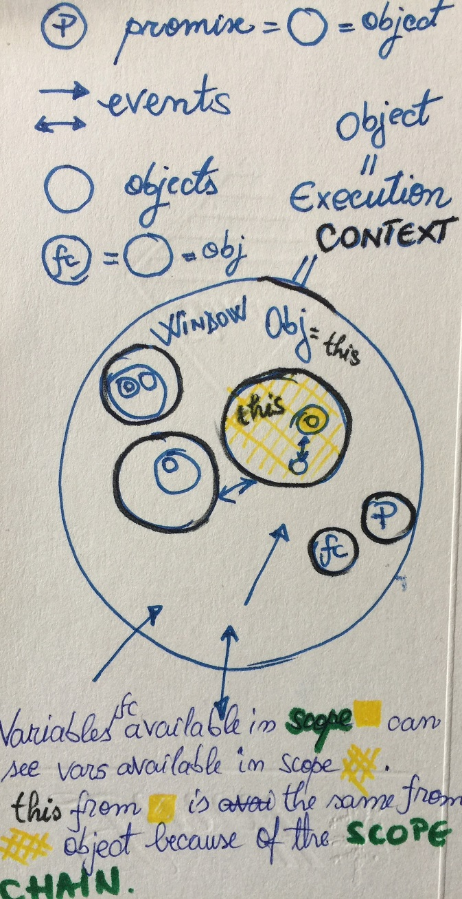
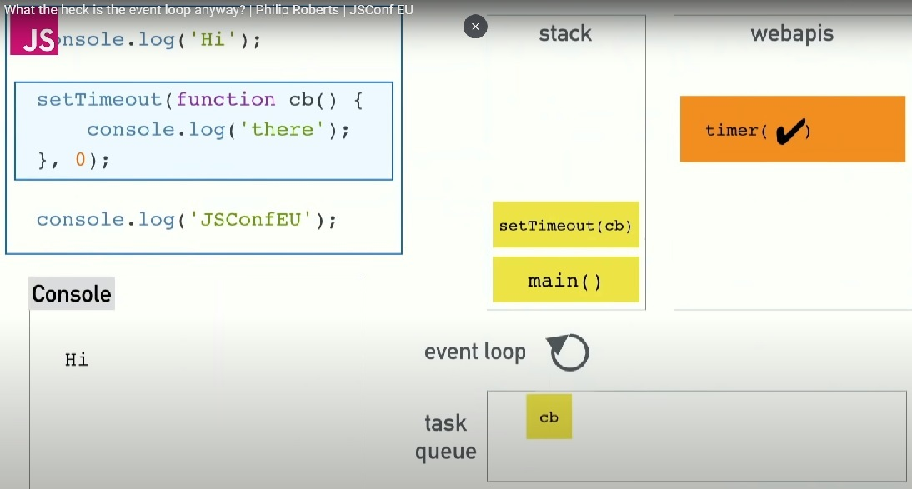

<!-- START doctoc generated TOC please keep comment here to allow auto update -->
<!-- DON'T EDIT THIS SECTION, INSTEAD RE-RUN doctoc TO UPDATE -->
**Table of Contents**  *generated with [DocToc](https://github.com/thlorenz/doctoc)*

- [Lesson learned - life is far easier when you have clarity and structure in your life! Be organized!](#lesson-learned---life-is-far-easier-when-you-have-clarity-and-structure-in-your-life-be-organized)
- [JavaScript Interview Questions](#javascript-interview-questions)
- [Coding - Algorithms problems](#coding---algorithms-problems)
- [Design question](#design-question)
- [JavaScript Theoretical Interview Questions](#javascript-theoretical-interview-questions)
  - [Naming conventions](#naming-conventions)
  - [JS code can be invoked in HTML in 3 ways](#js-code-can-be-invoked-in-html-in-3-ways)
  - [Javascript is loosly typed, dinamically typed](#javascript-is-loosly-typed-dinamically-typed)
  - [typeof() operator](#typeof-operator)
  - [Hoisting](#hoisting)
  - [Context (`this` keyword)](#context-this-keyword)
  - [Scope](#scope)
  - [Closure](#closure)
  - [Map & filter](#map--filter)
  - [Let & var](#let--var)
  - [Promises](#promises)
  - [Difference between == & ===](#difference-between---)
  - [Data types in JS](#data-types-in-js)
  - [call / bind / apply - set custom vals for `this` ( = alter the execution context)](#call--bind--apply---set-custom-vals-for-this---alter-the-execution-context)
  - [What represents the `arguments`  object](#what-represents-the-arguments--object)
  - [What is a callback](#what-is-a-callback)
  - [Built-in methods](#built-in-methods)
  - [Differences between your framework and others](#differences-between-your-framework-and-others)
  - [What makes JavaScript special (different) compared with other programming languages?](#what-makes-javascript-special-different-compared-with-other-programming-languages)
  - [arrow functions](#arrow-functions)
  - [What is difference between pass by value and pass by reference?](#what-is-difference-between-pass-by-value-and-pass-by-reference)
  - [Unit testing](#unit-testing)
  - [Testing: unit, acceptance, integration](#testing-unit-acceptance-integration)
  - [Position: static = default](#position-static--default)
  - [Position relative vs absolute](#position-relative-vs-absolute)
  - [Z-index](#z-index)
  - [Class vs ID](#class-vs-id)
  - [If there are two classes for the same element, with different properties, which one is applied?](#if-there-are-two-classes-for-the-same-element-with-different-properties-which-one-is-applied)
  - [CSS Specificity](#css-specificity)
  - [Two way bindings vs one way](#two-way-bindings-vs-one-way)
  - [Have you used any code quality tools](#have-you-used-any-code-quality-tools)
  - [Anonymous functions](#anonymous-functions)
  - [Why whould you use a framework for development](#why-whould-you-use-a-framework-for-development)
  - [Immutability  how to implement it in your code](#immutability--how-to-implement-it-in-your-code)
  - [Difference between forEach and map](#difference-between-foreach-and-map)
  - [Ternary operator  what it does and syntax](#ternary-operator--what-it-does-and-syntax)
  - [What css preprocessors do you know and why they are useful](#what-css-preprocessors-do-you-know-and-why-they-are-useful)
  - [How do you add a click listener in vanilla Js or jQuery?](#how-do-you-add-a-click-listener-in-vanilla-js-or-jquery)
  - [What are different ways HTML elements can be accessed in JS code?](#what-are-different-ways-html-elements-can-be-accessed-in-js-code)
  - [What is the difference between pseudo elements and pseudoclasses](#what-is-the-difference-between-pseudo-elements-and-pseudoclasses)
  - [What is the css box model?](#what-is-the-css-box-model)
  - [What is the difference between undeclared and undefined](#what-is-the-difference-between-undeclared-and-undefined)
  - [What is the difference between null and undefined](#what-is-the-difference-between-null-and-undefined)
  - [What is the difference between LocalStorage and SessionStorage](#what-is-the-difference-between-localstorage-and-sessionstorage)

<!-- END doctoc generated TOC please keep comment here to allow auto update -->

# Lesson learned - life is far easier when you have clarity and structure in your life! Be organized!

What I've learned the hard way is the fact that when developing a software we must have clear structure. All rules of life apply in sw dev. Here the requirement of clarity translates as following:

I) Understand terminology, language gives you power!

Document yourself very well. Give time to study the language you what to use when you make an implementation.
Each language, framework or library becomes very pleasant when you see it like a real life entity. When you find analogies between concepts from a language and real life, things stay in memory and the language makes more sense. The main reason we use programming is to make our life easier, by automatizetion of life work. The best part is that all processes around us, are great models to emulate. When it comes to coding, working mecanical is a very bad practice. To prevent this, we need to master some lingvistical concepts.
 For me, learning JavaScript becomes much easier when I use terms certen terms that I'm very familiar with, in my day to day life. Language is power, even thoung we are refering just to coding skils.
 For example, when you hear ``context``, this  means environment:  the global execution context = global environment; 
 Another usefull thing in JavaScript as to see everthing as an ``object``. Actually, in Javascript, arrays are objects, functions are objects. Basically, do consider everything as an object, excluding the data types of type primitives (number, string, boolean, null, undefined). Thus, also the environment is an object => global context  = window object = `this`.
 The window object has all kind of properties (inner objects =  objects that are inside the global environment). Thing at the window opened in your browser - it has inside all kind of stuff. There are a series of layes in a window, holding lots of data, stuff in order to render the final data that the visitor of that page sees. Like a human beeing that has organs that have, at their turn, cells... like that is the environment JavaScript is providing to you :-).

II) develop and verify (test) your products based on clear use cases:

-  start from the simplest scenario (equals variable initialization) and elaborate on it (add the algorithm)
- if it's hard to get I a natuaral way this kind of good stucture simple follow the model of TDD (test driven design) and Unit testing
- develop a few features/products based on such clear structures and you will get clarity
- basically what we do in programming is to use abstractions in order to solve complex problems of automatizing processes from real life
- nowdays coders are all around the word and compete with numerouse programmers working remotely
- thus heigher salaries in SW dev will no longer be for ordinary programmers, but rather for those that have more managerial skills, people skill, broader perspective and great ideeas to develop upon

III) Make yourself better at speaking about technical subjects by recording yourself speaking

Video content ideeas:

- Video 1: spend time in productive manneer: work on a blog, contribute wih usefull content on youtube, contribute on a open source project
- Video 2: explain my Marble Testing - Unit Testing github repo or any other repo with the subject I need to deepen at that time beeing
- Video 3: Security with Angular - securing Angular App - about the notes I took in my private repo
- Video 4: career subject - video talk about my programming experience - projects I worked in, how the interviewing process goes

# JavaScript Interview Questions

- !During interview, please give detailed answer to the technical questions you are asked!
- !Sell yourself well: tell about your current SW Engineer position, speak about the projects you worked in, about the role you had and the contribution in those projects you mentioned!
- Present yourself confident, resourceful e.g.

# Coding - Algorithms problems

[http://www.crackingthecodinginterview.com/uploads/6/5/2/8/6528028/cracking_the_coding_skills_-_v6.pdf](http://www.crackingthecodinginterview.com/uploads/6/5/2/8/6528028/cracking_the_coding_skills_-_v6.pdf)

Solving questions

- analitical skills
- problem solving
- comunication skills
- be eager to solve hard questions, push to hard problems
- have clean code
- have optimal solution ( O space & O time =  Big O)
- make tradeoffs
- strong foundation in CS (Data Structures, Algorithms, Concepts)

Implement DS/Algs - practice on paper; mock interviews( glassdoor, careercup)

Master Big O - How the runtime will scale with time

```JavaScript
//1. Has the complexity O(n) because runtime scales linearly:

for (i=0; i<n; i++) {
    console.log(i);
}

//2. Has the complexity O(n*n) because runtime scales linearly:

for (i=0; i<n; i++) {
    for (j=0; j<n; j++) {
    console.log(i, ',',j);

}

//3. Has the complexity O(n) because in big O we are concerned if it scales linearly. We do not say O(2n) or O(half of n) but O(n). We DROP CONSTANTS.

for (i=0; i<n; i++) {
    if (i%2 == 0) {
    console.log(i);

}

//4. Print evens and print odds - We have 2 loops. Each with complexity O(n) because in big O we are concerned if it scales linearly. O(n)+O(n) means a linear complexity: O(n).

for (i=0; i<n; i++) {
    if (i%2 == 0) {
    console.log(i);

}

for (i=0; i<n; i++) {
    if (i%2 != 0) {
    console.log(i);

}
//5. Print ordered pairs - complexity O(n*m) because in big O we use the lenght of the array or the depth of the tree

for (i=0; i<n; i++) {
    for (j=0; j<m; j++) {
    console.log(i, ',',j);

}

//5. Fibonacci part 1 - O(2^k) where the k is the depth of the tree

const fibonacci = function fibo(n) {
        
        if (n === 0 || n===1) {
          return 1;
        } else {
          return fib(n-1) + fib(n-2);
        }
      };

    /* Runtime is:
              fib(6)
      fib(5)          fib(4)
  fib(4) fib(3)   fib(3) fib(2)
  .............................

  => tree height of k; each level doubles the nodes => 2^k
      
  */
//6. Fibonacci part 1 - O(k) where the k is the depth of the tree

var fibonacci_series = function (n) {
        
        if (n === 1) {
          return [0, 1];
        }
        else {
          var s = fibonacci_series(n - 1); // function is put in call stack and the value of s will be [0, 1]
          s.push(s[s.length - 1] + s[s.length - 2]); // is call from call stack

 

          return s;
        }
      };
    /* Runtime is:
              fib(6)
      fib(5)        x 
  fib(4)     x
  .............................
      => O(k)

      Thus, when you see slow recursive algorithms, think about MEMOIZATION =  look for those repetitive problems
  */
```

For hard algoritms problems, the interviewer needs to see how you think;
- keep tring
- pay attention to the interviewer
- write real code
- declare your variables
- talk out loud to show the interviewer your thought process
# Design question

1. How would you approach the creation of an app? Do not do the app without first asking some details
2. Scope the problems (ask questions, make appropiate assumptions)
3. Define KEY concepts( can be somewhat naive)
4. Identify issues - botleneck trade-offs
5. Repair and Redesign

Example: Mention Layers: Front-end layer, Caching Layer, APIs Layer, Controller Layer, Data Layer
 and after that, add details for each layer;

 Drive discussion, but also be very sensitive about what the interviewer says. Read about desing of major companies - Just think about how they are done, do not memorize.

# JavaScript Theoretical Interview Questions

`I  have a rich Web Development experience. In the last 2 years I worked extesively with Front-end technologies`

- When mentioning a hobby thing about what kind of person the employee will percive you are.

`When it comes to hobbies, I must confesse I switch a lot between activities. But mainly, all my hobbies resume in creation activities. I get a great pleasure when rich to the end of a complex or difficult project. The pleasure is even greater when I know whith my creation I can contribute or help people. Long before I made beautifull paintings. Lately I developed a pation for a learning based side-project of mine. And I also have great interest for securing web apps and design patters study.`

- Sometimes, you will also have to solve some algoriths probles. Try out:
- [https://www.hackerrank.com/domains/data-structures](https://www.hackerrank.com/domains/data-structures)
- [https://learn.freecodecamp.org/#Basic-Algorithm-Scripting](https://learn.freecodecamp.org/#Basic-Algorithm-Scripting)
- [https://www.techseries.dev/daily](https://www.techseries.dev/daily) where you can train at solving problems.

 Examples of technical, theoretical questions:

## Naming conventions

- cannot use reserved keywords for vars
- vars shoud not start with a numeral
- vars in JS are case sensitive

## JS code can be invoked in HTML in 3 ways
- inline (inside HTML element: `<button type="button" onclick="documet.getElementById('tt)'.innerHTML='Just mess around'">Try it</button>`)
- external (include the script providing the src file reference)
- internal (JS code inside `<script> tag`)

## Javascript is loosly typed, dinamically typed

Unlike other languages, Javascript is loosly typed, dinamically typed - a variable can hold multiple types (eg number and string);
TypeScript is strongly typed =  staticaly typed

## typeof() operator

The typeof(operand), applied to the operand variable, returns the thype of that variable

##  Hoisting

- is about allocation of memory for each var, no matter the place where vars are declared. Should declare vars at the begin of file/scope; 
- use strict so that you'll get an error if you miss variable declaration before using it

## Context (`this` keyword)
 
 -  CONTEXT refers to the object to which a function belongs; `this` object, basically, is the environment. Global environment = Global execution CONTEXT.
 - In global scope `this` represents the window object;
 - Inside an inner fc/context `this` is `the object on which the event that triggerd the function happened` = is bound to the event handler referencing the DOM elem: `` myLink -> $( myLink ).on( click , myFc)``; - vars declared without keyword are global - bad practice  do not clutter the global object.

## Scope
- Is about the visibility of the variable
- There are two scopes: local and global;
##  Closure 

The inner function can access the variables of the enclosing function due to closures in JavaScript. In other words, the inner function preserves the scope chain of the enclosing function at the time the enclosing function was executed, and thus can access the enclosing function's variables.  Normally, when a function finishes execution,  it's vars cease to exist, but not in this case (scope chain).

```JavaScript
function outer() {
var b = 10;
   function inner() {
        
         var a = 20; 
         console.log(a+b);
    }
   return inner;
}
var X = outer(); 
console.dir(X);
```
A closure gives us access to an outer function's scope from an inner function. 


##  Map & filter

##  Let & var 
- Let keyword declares a var available only for that fc/block of declaration, var declares for the entire function/file

##  Promises

A promise is an object that may produce a single value some time in the future: either a resolved value, or a reason that it’s not resolved (e.g., a network error occurred). A promise may be in one of 3 possible states: 
- Fulfilled: onFulfilled() will be called (e.g., resolve() was called)
- Rejected: onRejected() will be called (e.g., reject() was called)
- Pending: not yet fulfilled or rejected.

Promise users can attach callbacks to handle the fulfilled value or the reason for rejection.
Promises are an esier way then callbacks to solve asynchronos code execution. Instead of using callbacks functions we return a `new Promise(resolve, reject)` object.
In order to use the promise we call the function and chain the then and catch methods. The then  is going to be our success callback and catch our fails callback.

```JavaScript
 function myPromiseFc() {
   return new Promise(resolve, reject) {
     if (0 == 0) {
       resolve('resolved info')
     } else {
       reject('reject info')
     }
   }
 }

 // And of course in order to use the promise we call the function and chain the then and catch methods

 myPromiseFc().then(msg => console.log(msg)).catch(err => console.log(err.message));
```
Promises solve the callback hell problem (when we need multiple callbacks): insted of nesting a callback inside a callback inside a callback, just chain `.then()` methods one after the other.
Promises are eager, meaning that a promise will start doing whatever task you give it as soon as the promise constructor is invoked.
They return all the result at once ( compared to the Observable streams of data, or with tasks - which are lazy).

We use `Promise.all([promise1, promise2, promise3]).then(messages){console.log(messages)}` method to get the responses after all promises passed as params are completed. The benefit is that all promisses start executing in the same time, and if one promisse is slow (e.g. gets some data from the server, the following promises do not wait for it to finish execution)
If we run ``Promise.race([promise1, promise2, promise3]).then(message){console.log(message)}`` it will return a soon as the first promise is completed.

##  Difference between == & === 
- used to check value  equality (compare variable's values) 
- === is strict equality - used to compare the val and type of variables
## Data types in JS
- primitives: number, boolean, string, undefined,null - is a primitive, though typeof(null)=object - a bug in JS
- objects(arrays,functions,obj,null)

## call / bind / apply - set custom vals for `this` ( = alter the execution context)

- All three functions(call, bind, apply) can be used to set values for `this` object.
- The apply() method calls a function with a given `this` value, and arguments provided as an array (or an array-like object).
- bind() creates a new function, from the initial one, where the value of `this` is the value provided as param: ``  const bindedFc= unbindedFc.bind(param)``
## What represents the `arguments`  object

- inside a function, `arguments` are the aargs of that function, as an array, with first element starting at position 0
## What is a callback

The callback is a function that has to be executed after another function has finished executing;
This callback function is provided as an argument to another function, in order to be executed as a callback.

## Built-in methods

- string.charAt
- string.concat
- array.forEach(fc) - calls a function on each on each element in the array
- string.indexOf(searched) - applied on a string, returns the index of the position the seached string passed as param is encountered in the string
- length - returns the length
- array.pop - removes the last elem from array and returns this elem
- array.push - adds one or more elems to the end of the array and returns the length of that array
- array.reverse() - reverses the order of the elements in the array


## Differences between your framework and others 

Well, I could say that my favorite framework is Angular, because the most complex UIs I developed were in Angular.
Unlike React or Vue, Angular comes with a complex CLI, has all the packages (including the router - out of the box), provides implementations for lazy loading pattern with RxJs and ngRx for REDUX pattern implementation. Also security plementation seems to me more rich in libraries for implementing protocols like OpenID Connect, Oauth, Auth 2.

Compared to it, React doesn't provide files with clear implementation of the MVC pattern.

## What makes JavaScript special (different) compared with other programming languages?
- scope global vs local  scope chain
- code is executed at runtime (thus is used on Client side - executed in browser)
- execution stack and event queue
- I would also mention the event loop. The way JS handles more than one tasks as a time. Thoungh JS is single-threaded, executes code synchronously, there is a way to handle async events with the help of the browser APIs. Js puts all the tasks to exe in the execution stack. When it has somethig to execute after a wile, a time interval, will notify a WebApi that sets a timer and takes care to push into the event queue the task, at the exact right time. After the exe stack is emptied, JS checks in the event que for tasks to executecute, and executes each tasks from event que, each time the stack is empty.
- other languages (CSS, HTML, PUG, JADE, Java can be transpiled into JavaScript)



- Js is compiled at runtime, runs mainly in browser but also on server,cross compilers convert different lang in Js and Java, 
- native query capabilities are available only through libs like underscore.js

## arrow functions 
 - short notation for anonymous functions,  the `=>` means return). An arrow function expression is similar to what in other programming languages is known as lambda functions
 - a great aspect is that the arrow function alredy binds the `this` keyword from inside the function to the context object where the arrow function is placed; thus if function is declare inside a component, `this` will be the context of that component;
 
##  What is difference between pass by value and pass by reference? 
Js always calls functions by directly  passing params values, not the address of variables. However, when the variable refers to an object which includes array, the value is the reference to the object  not basically the address of the object, but copy of the object.

## Unit testing 
Frameworks: MockaJs, AVA, Jest, Jasmine, Karma, Cypress 
## Testing: unit, acceptance, integration

## Position: static = default

- z-index does not work with position-static;

## Position relative vs absolute

`position relative` means relative to itself = position elements one after the other and shift elements by specified top, left, bottom and right values from where the element would normally be; After setting position to relative z-index is enabled, and if not specified will set the layer of element the top layer; 
`position: fixed` means positioned relative to the viewport, or the browser window itself.
 The viewport doesn't change when the window is scrolled, so a fixed positioned element will stay right where it is when the page is scrolled(to fix buttons under this element use CSS  scroll-margin-top: 5rem; /* whatever is a nice number that gets you past the header */
`position: sticky` for an element means the element will just sit there like a static element, but as you scroll past it, if it's parent element has room (usually: extra height) the sticky element will behave as if it's fixed until that parent element is out of room. ;

`position: absolute` is used in order to place any page elem exactly where you want it; specify `top`, `left`, `right`, `bottom` relative to the immediately outer parent element with absolute  if there is none, pos will be relative to the html page.
 - elements assigned the `position: absolute` property, are removed from the flow of elements on the page, thus don't over use it;

## Z-index 

`z-index: ` is an integer value representing the number of the view layer;
- closest layer to the viewer has the greater value and is the most visible
 
##  Class vs ID 
We use . for class selectors, wich are not unique in an HTML element
We use # for HTML elements IDs wich are unique in HTML pages

##  If there are two classes for the same element, with different properties, which one is applied?

-  the one with higher specificity 
-  the one with the more specific rule,
-  the one with the last rule defined,
-  the one with the embeded CSS,
- class selector beats element selector;

##  CSS Specificity 
- for body specificity is 0,0,0,0
 Specificity ierarhy: 
 - inline style(specificity 1000) > IDs( specificity 100)>class selector and pseudoclass selectors(specificity 10) beats>elements(p has specificity 1) & pseudoelements selectors (:before has specificity 10)

## Two way bindings vs one way 
 - from template to js via input, from js to template  in React by default -2 waydata binding, in Angular  use [(ngModel)], in Vue `v-model`

## Have you used any code quality tools 
 - I use Linters (JSLint, TSLint)

## Anonymous functions 

Function literal, lambda abstraction, or lambda expression is a function definition that is not bound to an identifier ( doesn't have a name). Anonymous functions are often arguments being passed to higher-order functions, or used for constructing the result of a higher-order function that needs to return a function. If the function is only used once, or a limited number of times, an anonymous function may be syntactically lighter than using a named function. Anonymous functions are ubiquitous in functional programming languages and other languages with first-class functions( passsed as param to map, filter, sort, reduce, includes, some, every, find), where they fulfill the same role for the function type as literals do for other data types.

## Why whould you use a framework for development

I use frameworks for the abstraction they offer.
Frameworks do all of the heavy lifting for us so that we can concentrate on building great products. 
Good implementation of design patterns starting with MVC, Lazy loading, Singleton, Factory, Observer, Redux (Redux is not for every implementaion but it has it's benefits).
Frameworks promote and ease the develpment following good practices, provide easy setup running configuration files, CLIs, wich are great.

## Immutability  how to implement it in your code  
- do not mutate array, preferably do not use foreach but rather use map, filter- all the functions should return a value (not void type) and shoud not change global variables; alternative: use immutable.js or Mori libs.
## Difference between forEach and map
- one mutates the array : forEach receives as param a fc. and applies that fc. for each elem  of the array and  does not return anything;
- map does not mutate the array, but creates a new array using the function passed as argument and  returns that new array
## Ternary operator  what it does and syntax 
- short if statement: cond ? onTrue : onFalse
## What css preprocessors do you know and why they are useful
- SASS,LESS  write css in a cleaner manner

## How do you add a click listener in vanilla Js or jQuery? 
$( #myElem ).on( click , functionToExe);

## What are different ways HTML elements can be accessed in JS code?

document.getElementById('idvalue')
document.getElementByClassName('className')
document.getElementByTagName('p')
document.querySelector('p.myParagraphName > div') <!-- gets as param a CSS style selector and returns the first occurence of the element that maches the query -->

## What is the difference between pseudo elements and pseudoclasses 
Pseudo-classes = fake classes, have the benefit that they select regular elements but under certain conditions(not all the time), like when their position relative to siblings or when they are under a particular state, dynamic :link, :visited, :hover, :active,:focus, :first-child, :nth-child(n) , :nth-last-child(n), :nth-of-type(n),:nth-last-of-type(n), :last-child, :first-of-type, :last-of-type, :only-child, :only-of-type, :root, :empty
Other pseudo-classes:  :not(x), :target, :lang(language)
Pseudo-elements = fake elements, effectively create new elements that are not specified in the mark-up of the document and can be manipulated much like a regular element. The  benefit is that they allow to create cool effects with minimal mark-up (::before, ::after, ::first-letter, ::first-line)

## What is the css box model? 
 each HTML element is wrapped inside a box(has: margin-border-pading-width+height)  can visualize it in Firebug. Use CSS reset (framework or custom CSS reset) in order to remove default browser stylings(default padding and margin of elements).

## What is the difference between undeclared and undefined

- `undefined` is a primitive;
- `undefined` is a property of the global object
- variables are of type `undefined` if they were declared but not initialized
- undeclared are those variables that are not declared (with var, let, const or without keyword - bad practice - those declare without keyword will have a global scope - clutter the `window` object)

## What is the difference between null and undefined

 We can use `null` to initialize variables, thought typeof(null)  returns object (this is a bug in JS), `null` is a primitive, and thus we can use it to initialize vars of type number, boolean, string;

`undefined` is a primitive in Javascript. `undefined` is a property of the global object. Do not use it tu initialize variables!
A variable has the value undefined if it was not initialized. A function has the value undefined if does not return a value
 typeof(undefined) is undefined. To determine whether a variable has a value use strict comparison ``typeof(variable) === 'undefined'``
 
  ## What is the difference between LocalStorage and SessionStorage

  Both LocalStorage and SessionStorage store data on client side;
  LocalStorage data stays until is manually cleared through settings or explicitlly  through program
  Session Storage gets cleared when you close the browser